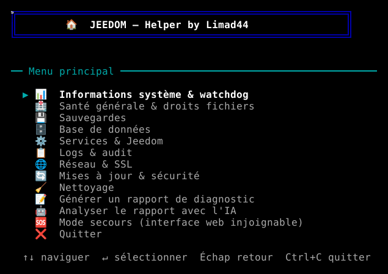

# jeehelp

Menu d'administration en ligne de commande pour une box Jeedom (Debian 11/12, Jeedom >= 4.4).
Un seul script bash, sans dépendance externe, pensé pour l'entretien courant d'une installation
Jeedom en SSH : sauvegardes, base de données, services, logs, réseau, mises à jour et sécurité.

Navigation interactive : ↑↓ sélection, ENTRÉE valider, ÉCHAP retour, CTRL+C quitter.


Chaque action sensible (restauration, suppression, reboot, mise à jour...) demande une
confirmation, et les actions sont journalisées dans `/var/log/jeedom-menu.log`.

## Installation

Sur la box Jeedom, en une commande (avec `curl`, présent par défaut sur Jeedom) :

```bash
curl -fsSL https://raw.githubusercontent.com/limad/jeehelp/beta/install.sh | sudo bash
```

Ou avec `wget` si `curl` n'est pas disponible :

```bash
wget -qO- https://raw.githubusercontent.com/limad/jeehelp/beta/install.sh | sudo bash
```

Cela installe la commande `jeehelp` dans `/usr/local/bin/jeehelp`.

### Installation depuis un clone local

```bash
git clone https://github.com/limad/jeehelp.git
cd jeehelp
sudo bash install.sh
```

## Utilisation

```bash
limad@Jeedom:~$ jeehelp
```

Lance le menu interactif. `jeehelp` nécessite les droits root (relance automatiquement un
message d'erreur si lancé sans `sudo`) et détecte Jeedom dans `/var/www/html`.

### Menu principal

| Section | Contenu |
|---|---|
| 📊 Informations système & watchdog | OS, uptime, charge, RAM, disque, version Jeedom, vérification watchdog |
| 🏥 Santé générale & droits fichiers | Diagnostic complet (PHP, MariaDB, services, daemon, disque, RAM, CPU, dernière sauvegarde, permissions, logs d'erreurs, SSL, mises à jour apt) + rétablissement des droits fichiers |
| 💾 Sauvegardes | Lister, créer, restaurer, supprimer, rotation (conserve les 3 dernières) |
| 🗄️ Base de données | ANALYZE / REPAIR / OPTIMIZE table par table, taille des tables, `mysqlcheck --auto-repair`, dump SQL complet, import d'un dump, vidage du cache Jeedom |
| ⚙️ Services & Jeedom | État des services, redémarrage Apache/Nginx, MariaDB, daemon Jeedom (cron), relance complète de Jeedom, reboot serveur |
| 📋 Logs & audit | Lister/afficher/suivre (`tail -f`) les logs Jeedom, vider tous les logs, journalctl système, journal d'audit des actions jeehelp |
| 🌐 Réseau & SSL | Interfaces réseau, test de connectivité internet, ports en écoute, connexions actives, ping, vérification SSL d'un domaine |
| 🔄 Mises à jour & sécurité | Vérifier/appliquer les mises à jour Jeedom, `apt update && upgrade`, configuration `unattended-upgrades` (le redémarrage automatique après mise à jour du noyau est **optionnel, refusé par défaut**), dry-run et statut |
| 🧹 Nettoyage | Purge des vieilles sauvegardes, nettoyage de `/tmp` (avec aperçu et confirmation), analyse de l'espace disque, vidage de l'OPcache PHP, `apt autoremove` |
| 📝 Rapport de diagnostic | Document unique mettant en évidence tout ce qui peut justifier un blocage : état du core (cron, scénarios, démarrage, date), contrôles de la page Santé, accessibilité de l'interface et de la page de secours, plugins actifs avec état des daemons et dépendances, MariaDB (connexions, taille), ressources (disque, inodes, mémoire, swap, OOM), services et unités en échec, erreurs fatales PHP par plugin, messages Jeedom, sauvegardes, droits, réseau, mises à jour, actions récentes de jeehelp. Synthèse des erreurs/avertissements en tête ; enregistré dans `log/jeehelp_rapport_<date>.txt` (10 derniers conservés), sans secret |
| 🤖 Analyse par IA | `sudo jeehelp --ask` envoie le rapport à une IA et affiche gravité, causes probables (avec preuves tirées du rapport) et actions proposées. **Local d'abord** (Ollama sur le réseau local), puis les autres fournisseurs du plugin `ai_assistant` (via son script CLI, sans Apache ni clé API Jeedom), puis une API directe optionnelle (seul canal si Jeedom/MariaDB sont HS). **Cloud** : rapport anonymisé (IP, MAC, hôte, chemins, logs retirés, secrets masqués) et accord demandé par fournisseur. **L'IA ne fait que proposer** : seules les actions d'un catalogue fixe (`check`, `health`, `report`, `fix-perms`, `repair-db`, `backup`) sont reconnues, chacune demande une confirmation `[o/N]`, et rien n'est exécuté hors terminal ni à partir du texte de la réponse. Options : `--pick` (liste de choix), `--provider ID`, `--file rapport.txt`, `--channel auto\|plugin\|direct`, `--with-logs`, `--include-invalid` (proposer aussi les fournisseurs que le plugin marque invalides ; désactivés et invalides sont exclus par défaut), `--dry-run` (affiche la charge utile cloud sans rien envoyer) |
| 🆘 Mode secours | Pour quand l'interface web de Jeedom (y compris sa propre page de secours `index.php?v=d&p=database&rescue=1`) est injoignable. Teste l'accès à cette page web, et reproduit en CLI ses deux actions clés : désactiver tous les plugins, activer/désactiver le système cron. Actions journalisées dans `log/jeehelp_rescue.log` (visible depuis Jeedom une fois l'interface de nouveau accessible) en plus du journal d'audit |

### Arborescence du menu

```text
Menu principal
├── 📊 Informations système & watchdog
├── 🏥 Santé générale & droits fichiers
│   ├── 🔍 Vérification générale (health check)
│   └── 🔑 Rétablissement des droits fichiers/dossiers
├── 💾 Sauvegardes
│   ├── 📋 Lister les sauvegardes
│   ├── ➕ Créer une sauvegarde
│   ├── 📤 Restaurer une sauvegarde
│   ├── 🗑️ Supprimer une sauvegarde
│   └── 🔄 Rotation (garder 3 dernières)
├── 🗄️ Base de données
│   ├── 📊 Analyser (ANALYZE TABLE)
│   ├── 🔧 Réparer (REPAIR TABLE)
│   ├── ⚡ Optimiser (OPTIMIZE TABLE)
│   ├── 📏 Taille des tables
│   ├── 🔍 mysqlcheck complet (--auto-repair)
│   ├── 💾 Dump SQL complet
│   ├── 📥 Importer un dump
│   └── 🧹 Vider le cache Jeedom
├── ⚙️ Services & Jeedom
│   ├── 📡 État des services
│   ├── 🌐 Redémarrer Apache / Nginx
│   ├── 🗄️ Redémarrer MariaDB
│   ├── ⚙️ Redémarrer daemon Jeedom (cron)
│   ├── 🔄 Relancer Jeedom complet
│   └── 💻 Reboot serveur
├── 📋 Logs & audit
│   ├── 📋 Lister les logs
│   ├── 👁️ Afficher un log (50 lignes)
│   ├── 📡 Suivre un log en temps réel (tail -f)
│   ├── 🗑️ Vider tous les logs
│   ├── 🔧 Journalctl système
│   └── 📒 Journal des actions (audit)
├── 🌐 Réseau & SSL
│   ├── 🌐 Interfaces réseau
│   ├── 📡 Test connectivité internet
│   ├── 🔌 Ports en écoute
│   ├── 🔗 Connexions actives
│   ├── 📶 Ping une adresse
│   └── 🔒 Vérifier SSL d'un domaine
├── 🔄 Mises à jour & sécurité
│   ├── 🔍 Vérifier mises à jour Jeedom
│   ├── ⬆️ Mettre à jour Jeedom (core)
│   ├── 📦 apt update + upgrade
│   ├── 🔒 Configurer unattended-upgrades
│   ├── 🧪 Dry-run unattended-upgrades
│   └── 📊 Statut unattended-upgrades
├── 🧹 Nettoyage
│   ├── 🗑️ Vieilles sauvegardes (> 3 jours)
│   ├── 🧹 Nettoyer /tmp
│   ├── 💿 Analyse espace disque
│   ├── ⚡ Vider OPcache PHP
│   └── 📦 apt autoremove
├── 📝 Générer un rapport de diagnostic
├── 🤖 Analyser le rapport avec l'IA
│   ├── Liste « Fournisseur IA » : Automatique (local d'abord, puis les suivants)
│   └── ou un fournisseur actif et valide du plugin ai_assistant (🏠 local, ☁️ cloud)
├── 🆘 Mode secours (interface web injoignable)
│   ├── 🔗 Tester l'accès à la page de secours web
│   ├── 🧩 Désactiver tous les plugins
│   ├── ⏱️ Désactiver le système cron
│   └── ⏱️ Activer le système cron
└── ❌ Quitter
```

Chaque sous-menu se termine par « ↩ Retour » (ou la touche ÉCHAP). Les entrées sans sous-menu (informations système, rapport) s'exécutent directement.

### Depuis un autre poste (SSH)

Le menu a besoin d'un terminal : ajoutez `-t` à la commande SSH (sans lui : « Aucun terminal détecté »).

```bash
ssh -t utilisateur@box "sudo jeehelp"
```

Les options CLI ci-dessous fonctionnent sans `-t` : `ssh utilisateur@box "sudo jeehelp --check"`.

**Télécharger une sauvegarde** sur votre poste (sans `-t`, le flux est binaire) :

```bash
ssh utilisateur@box "sudo jeehelp --download"                              # liste numérotée (1 = la plus récente)
ssh utilisateur@box "sudo jeehelp --download 1" > sauvegarde.tar.gz        # télécharge la n°1
```

Archives Jeedom (`*.tar.gz`) et dumps SQL (`dump_*.sql.gz`) sont proposés, du plus récent au plus ancien. Le nom, la taille et le sha256 sont affichés sur stderr pour vérifier l'intégrité ; le script refuse d'écrire du binaire sur un terminal. Chaque téléchargement est journalisé. Une sauvegarde contient des secrets : stockez-la en lieu sûr.

### Mode CLI (non-interactif)

```bash
sudo jeehelp --backup            # Lancer une sauvegarde Jeedom
sudo jeehelp --self-update       # Mettre jeehelp à jour depuis GitHub (aperçu + confirmation ; --yes sans question, --branch alpha)
sudo jeehelp --download [N]      # Lister les sauvegardes, ou envoyer la N-ième sur stdout (voir SSH ci-dessus)
sudo jeehelp --repair-db         # REPAIR TABLE sur toutes les tables
sudo jeehelp --check             # Vérification rapide (watchdog + SSL)
sudo jeehelp --health            # Health check complet (équivalent au menu "Santé")
sudo jeehelp --report            # Rapport de diagnostic complet (code retour : 0 OK, 1 avertissement, 2 erreur)
sudo jeehelp --ask               # Analyse du rapport par IA (voir ci-dessous)
sudo jeehelp --fix-perms         # Rétablir les droits fichiers de /var/www/html
sudo jeehelp --upgrade-security  # Lancer unattended-upgrade immédiatement
```

Utile pour un cron ou un script d'automatisation externe à Jeedom (ex. `jeehelp --check` en
cron quotidien, ou `jeehelp --backup` avant une mise à jour manuelle).

## Mise à jour

```bash
sudo jeehelp --self-update
```

Télécharge la dernière version depuis la branche `beta`, vérifie la syntaxe, affiche un aperçu
(empreintes, lignes modifiées, dernier commit) et demande confirmation avant de remplacer
`/usr/local/bin/jeehelp`. L'ancienne version est gardée dans `/usr/local/bin/jeehelp.prev`
(retour arrière : `sudo cp /usr/local/bin/jeehelp.prev /usr/local/bin/jeehelp`).
Options : `--yes` (sans confirmation, pour un script) et `--branch alpha` (version de test).
Relancer la commande d'installation reste possible et donne le même résultat.

## Analyse par IA : configuration

Rien n'est requis si le plugin `ai_assistant` a au moins un fournisseur configuré. Fichier optionnel `/etc/jeehelp/ai.conf` (root, mode 600) :

```ini
AI_ALLOWED_CLOUD="2386 direct"   # fournisseurs cloud déjà autorisés (rempli par l'accord interactif)
AI_ORDER="2981 2386"             # ordre de préférence des fournisseurs cloud
AI_DIRECT_URL="https://api.openai.com/v1/chat/completions"   # canal direct (API compatible OpenAI)
AI_DIRECT_MODEL="gpt-4o-mini"
AI_DIRECT_KEY="..."              # facultatif (inutile pour un Ollama local)
```

Le script `plugins/ai_assistant/core/php/ai_assistant.cli.php` (`list`, `ask`) est fourni par le plugin ; il refuse les équipements en mode `jeeAssist` sans confirmation et ceux dont le repli entre fournisseurs est actif.
